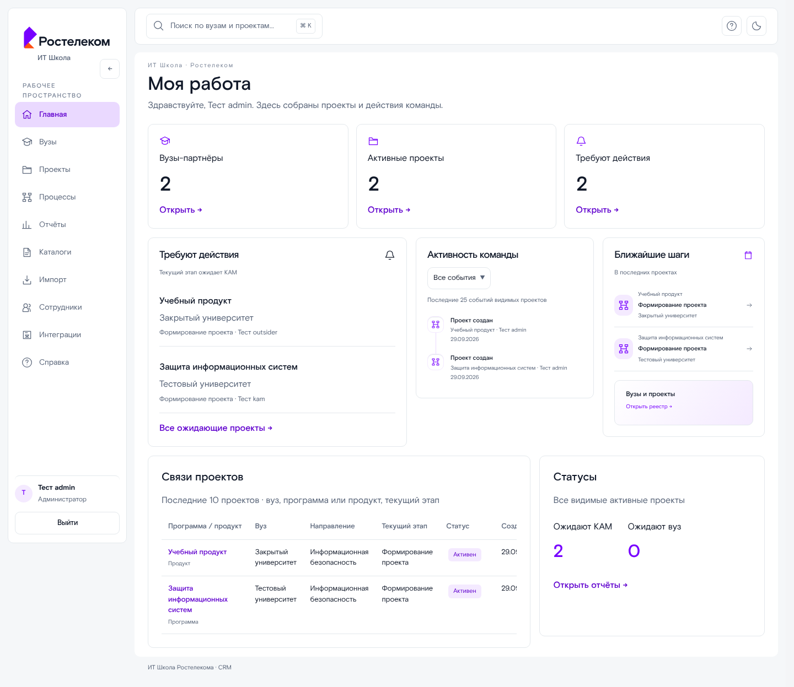

# Работа с CRM

## Вход и навигация

Откройте адрес CRM и выберите «Войти через корпоративный аккаунт». Учётную запись и роль предоставляет администратор Keycloak. В меню появляются разрешённые разделы. Быстрый поиск открывается кнопкой в верхней панели или Ctrl/Cmd + K; стрелки выбирают результат, Enter открывает его, Escape закрывает поиск. Тема переключается в верхней панели. Кнопка «Настройки» открывает данные профиля и ссылки на безопасность учётной записи в Keycloak; там же можно выбрать фирменный или системный шрифт. На телефоне меню открывается кнопкой «Меню».

На локальном стенде доступны [три тестовые учётные записи](../../README.md#локальные-учётные-записи) с ролями КАМ, руководителя и администратора CRM.

Главная показывает три серверных показателя: вузы-партнёры, активные проекты и проекты, требующие действий. Действие определяется ожиданием КАМ на текущем этапе. Блоки последних событий и следующих шагов указывают область своей выборки.

## Вуз и проект

1. Откройте «Вузы», найдите вуз или создайте новый при наличии права.
2. В карточке добавьте контакт: ФИО и хотя бы email или телефон. Выберите основной контакт. Ответственные КАМ назначаются отдельно.
3. Выберите «Новый проект», укажите вуз, направление, **программу или продукт** и ответственного КАМ.
4. В карточке проекта заполните вендора, номер договора, дату подписания лицензии, срок действия и статус передачи. Пустые необязательные поля очищаются на сервере.
5. При наличии прав смените ответственного или назначьте руководителя.

Карточка вуза объединяет его проекты. Разделы документов, действий и истории работают с выбранным видимым проектом; отдельная сущность заявки или задачи не создаётся.

## Этапы, документы, комментарии

Проект начинается с неизменяемого этапа «Формирование проекта». Пользователь с правом настройки и уровнем не ниже руководителя может настроить последующие этапы: название, порядок, ожидаемую сторону/контакт и обязательные типы документов. После подтверждения первого перехода состав workflow фиксируется.

Во вкладке «Документы» прикрепите файл к требованию **текущего этапа**. Размер — до 25 МБ; допустимые расширения указаны в форме. Обязательные документы должны быть приложены до перехода. Можно отметить файл завершённым и скачать его; скачивание повторно проверяет доступ. На последнем этапе руководитель с соответствующим правом может закрыть проект. Закрытая карточка доступна для просмотра; изменения запрещены.

Во вкладке «Комментарии» создавайте сообщения и ответы. Изменение и удаление доступны автору или руководству при наличии соответствующего права. Удалённый комментарий сохраняется как отметка без прежнего текста, ответы остаются. Вкладка «История» показывает подтверждённые сервером действия, даты и авторов; для переходов отображаются исходный и новый этапы.

## Отчёты и статистика

Выберите шаблон или «Конструктор», настройте фильтры и колонки. Для периода заполните обе даты; программа и продукт не выбираются одновременно. Предпросмотр имеет пагинацию. Выберите XLS, XLSX, PDF или JSON и нажмите «Сформировать файл». В очереди дождитесь «Готово», затем скачайте результат. Полный отчёт отдельного проекта создаётся из его карточки без периода.

В «Статистике» те же фильтры применяются к серверным агрегатам. Диаграммы сопровождаются таблицей данных; PNG/PDF формируются worker. Просмотр отчётов и статистики определяется разными правами.

## Каталоги и импорт

Направления, программы и продукты редактируются в «Каталогах» при наличии права. В «Импорте» скачайте согласованный шаблон XLSX, заполните листы и загрузите XLS/XLSX до 10 МБ. Дождитесь проверки, изучите предпросмотр действий и ошибок, затем отдельно подтвердите применение допустимых строк. Файл ошибок доступен для скачивания. Формат и правила — в [руководстве импорта](../catalog-import.md).

## Администрирование

- **Сотрудники:** учётные записи и роли создаются в Keycloak. В CRM выберите КАМ и задайте режим видимости: по назначениям, всё либо разрешённые вузы/проекты. Разрешённый вуз открывает его проекты; отдельно разрешённый проект не открывает остальные проекты и карточку вуза. Ограничения не применяются к руководителям и администраторам.
- **Права:** измените минимальный уровень конкретной операции и сохраните. Bootstrap-право управления остаётся административным. Сервер проверяет право и область видимости независимо.
- **Интеграции:** отображаются реальные состояния и история LMS/сайта. `NOT_IMPLEMENTED` означает отсутствие адаптера; запуск недоступен до получения и реализации внешнего контракта.
- **Эксплуатация:** установка и production-развёртывание описаны в [README](../../README.md) и [серверном руководстве](../stage2-operations.md). Публичная диагностика находится на `/status`.

## Ошибки и сессия

При ошибке загрузки используйте «Повторить». Конфликт означает, что состояние проекта изменилось или операция уже недоступна; обновите карточку. Ошибка доступа требует проверки прав администратором. После завершения сессии войдите снова. «Выйти» очищает данные клиента и завершает корпоративную сессию. Не закрывайте браузер до сохранения формы.

## Примеры экранов

Снимки получены из production-клиента на одноразовом тестовом стенде. Имена, контакты и проекты синтетические.

| Экран                        | Снимок                                         |
| ---------------------------- | ---------------------------------------------- |
| Мобильная главная            | [Открыть](./images/dashboard-mobile.png)       |
| Реестр проектов, тёмная тема | [Открыть](./images/projects-dark.png)          |
| Контакты вуза                | [Открыть](./images/university-desktop.png)     |
| Проект и история             | [Открыть](./images/project-desktop.png)        |
| Отчёт и очередь файлов       | [Открыть](./images/reports-desktop.png)        |
| Статистика                   | [Открыть](./images/statistics-desktop.png)     |
| Предпросмотр импорта         | [Открыть](./images/import-desktop.png)         |
| Видимость КАМ и права        | [Открыть](./images/administration-desktop.png) |

Результаты проверки перечислены в [отчёте](./verification.md).
